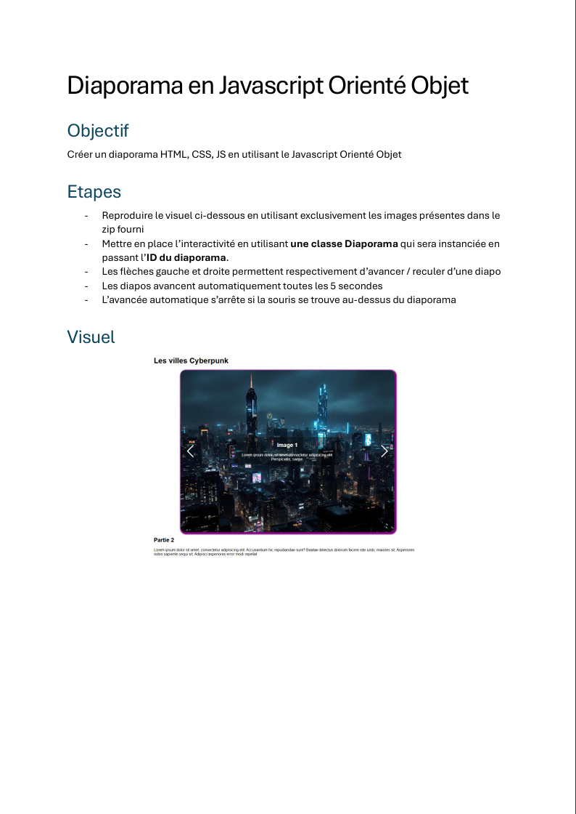

# Diaporama - JavaScript Slideshow

## Overview
This project involves creating an interactive slideshow using JavaScript. The goal is to replicate a given visual using only the images provided in the supplied ZIP file.

## Features
- Navigation using left and right arrows to move between slides.
- Automatic slide transition every 5 seconds.
- Automatic transition stops when the mouse hovers over the slideshow.
- Implemented using a `Diaporama` class that is instantiated with the slideshow ID.

## Requirements
- HTML, CSS, and JavaScript
- Images provided in the ZIP file

## Installation & Usage
1. Extract the provided ZIP file containing the images.
2. Include the necessary HTML structure for the slideshow.
3. Implement the `Diaporama` class in JavaScript.
4. Ensure the slideshow starts automatically and handles user interactions as specified.

## Implementation Details
- The `Diaporama` class should handle image transitions and user interactions.
- Event listeners should be added for arrow key navigation and mouse hover detection.
- Use `setInterval()` to automate slide transitions and `clearInterval()` to pause them on hover.

## How to Use
1. Open the HTML file in a browser.
2. Use the left and right arrows to navigate through slides.
3. Allow the slideshow to run automatically or hover over it to pause.

## Screenshot

## Author
[Makombela Job]  

Happy coding!
